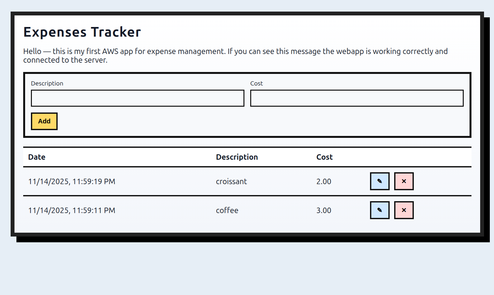

# AWS App - Expenses

Small single-process Expenses management HTTPS webapp. The server serves a static UI from `/public` and provides a Postgres-backed API.



Demo: https://tmd-aws.ddns.net/

(Note: It may not work all the time because I might disable it to avoid losing cloud cost or ddos attack xD)

## Techstack

- Backend: [![nodejs][nodejs-logo]][nodejs-url]

- Database: [![PostgreSQL][postgresql-logo]][postgresql-url]

- Reverse Proxy: [![NGINX][NGINX-logo]][NGINX-url]

- Hosting: AWS EC2

- Monitoring: AWS CloudWatch

- DNS: Domain name registered at https://www.noip.com/

- HTTPS Certificate: Certbot

## Layout
- `public/` - static frontend: `index.html`, `app.js`, `styles.css`
- `src/` - server source
	- `src/index.js` - Express server entry (serves `public/` and provides API)
	- `src/db.js` - Postgres pool (reads from `.env`)

## Quickstart

1) Create DB and the `expenses` table manually (example using psql):

```sql
CREATE TABLE expenses (
	id SERIAL PRIMARY KEY,
	datetime TIMESTAMP NOT NULL,
	description TEXT NOT NULL,
	cost NUMERIC(12,2) NOT NULL
);
```

2) Run the app from the project root

Inside .env:
```
PORT=4000
DB_HOST=localhost
DB_PORT=5432
DB_USER=postgres
DB_PASSWORD= {your_password}
DB_NAME= {your_database_name}
```

Run:

```bash
npm install
npm start
```

Open http://localhost:4000 in your browser. The web UI includes a short greeting at the top when the app is running.

## API
- GET /api/expenses
- POST /api/expenses  { datetime, description, cost }  (create — server expects datetime ISO string)
- PUT /api/expenses/:id  { description, cost }  (update — datetime is preserved; only description and cost are changed)
- DELETE /api/expenses/:id

## Validation
- description: required non-empty string
- cost: non-negative number


[NGINX-logo]: https://img.shields.io/badge/NGINX-EEEEEE?logo=NGINX&logoColor=0E9748
[NGINX-url]: https://nginx.org/

[nodejs-logo]: https://img.shields.io/badge/Node.js-181717?logo=node.js&logoColor=green
[nodejs-url]: https://nodejs.org/en

[postgresql-logo]: https://img.shields.io/badge/PostgreSQL-366594?logo=postgresql&logoColor=FFFFFF
[postgresql-url]: https://www.postgresql.org/